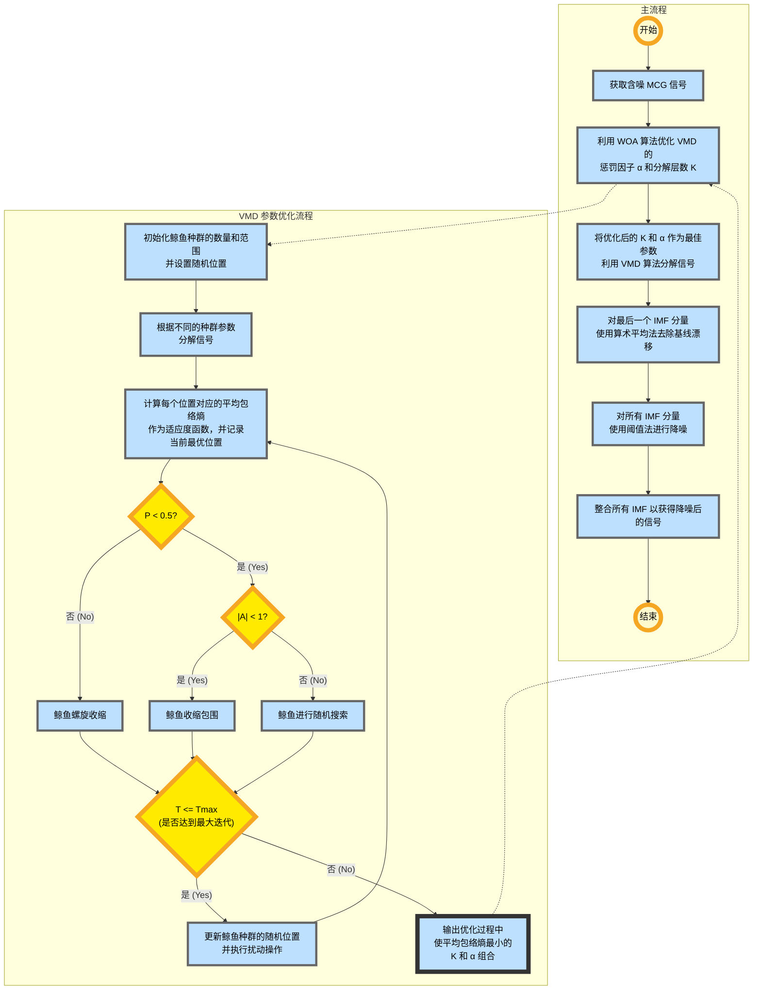

```mermaid
graph TD
    %% 定义样式
    classDef process fill:#bde0fe,stroke:#666,stroke-width:4px,color:black;
    classDef decision fill:#ffea00,stroke:#f5a623,stroke-width:8px,color:black;
    classDef startend fill:#fffacd,stroke:#f5a623,stroke-width:8px,color:black;
    classDef output fill:#bde0fe,stroke:#333,stroke-width:8px,color:black;

    %% --- 右侧主流程 ---
    subgraph MainFlow [主流程]
        direction TB
        Start((开始)):::startend
        Acquire[获取含噪 MCG 信号]:::process
        
        %% 这里对应左侧的优化过程
        Optimize[利用 WOA 算法优化 VMD 的<br/>惩罚因子 α 和分解层数 K]:::process
        
        UseParams[将优化后的 K 和 α 作为最佳参数<br/>利用 VMD 算法分解信号]:::process
        RemoveBaseline[对最后一个 IMF 分量<br/>使用算术平均法去除基线漂移]:::process
        Threshold[对所有 IMF 分量<br/>使用阈值法进行降噪]:::process
        Integrate[整合所有 IMF 以获得降噪后的信号]:::process
        End((结束)):::startend

        Start --> Acquire
        Acquire --> Optimize
        Optimize --> UseParams
        UseParams --> RemoveBaseline
        RemoveBaseline --> Threshold
        Threshold --> Integrate
        Integrate --> End
    end

    %% --- 左侧 VMD 参数优化流程 ---
    subgraph Optimization [VMD 参数优化流程]
        direction TB
        Opt_Init[初始化鲸鱼种群的数量和范围<br/>并设置随机位置]:::process
        Opt_Decomp[根据不同的种群参数<br/>分解信号]:::process
        Opt_Fitness[计算每个位置对应的平均包络熵<br/>作为适应度函数，并记录<br/>当前最优位置]:::process
        
        %% 修复点：必须加双引号
        Dec_P{"P < 0.5?"}:::decision
        Dec_A{"|A| < 1?"}:::decision
        
        Action_Spiral[鲸鱼螺旋收缩]:::process
        Action_Shrink[鲸鱼收缩包围]:::process
        Action_Random[鲸鱼进行随机搜索]:::process
        
        Dec_T{"T <= Tmax<br/>(是否达到最大迭代)"}:::decision
        
        Action_Update[更新鲸鱼种群的随机位置<br/>并执行扰动操作]:::process
        Opt_Output[输出优化过程中<br/>使平均包络熵最小的<br/>K 和 α 组合]:::output

        Opt_Init --> Opt_Decomp
        Opt_Decomp --> Opt_Fitness
        Opt_Fitness --> Dec_P
        
        Dec_P -- 否 (No) --> Action_Spiral
        Dec_P -- 是 (Yes) --> Dec_A
        
        Dec_A -- 是 (Yes) --> Action_Shrink
        Dec_A -- 否 (No) --> Action_Random
        
        Action_Spiral --> Dec_T
        Action_Shrink --> Dec_T
        Action_Random --> Dec_T
        
        Dec_T -- 是 (Yes) --> Action_Update
        Action_Update --> Opt_Fitness
        
        Dec_T -- 否 (No) --> Opt_Output
    end

    %% 连接两个子图的逻辑关系
    Optimize -.-> Opt_Init
    Opt_Output -.-> Optimize
```
