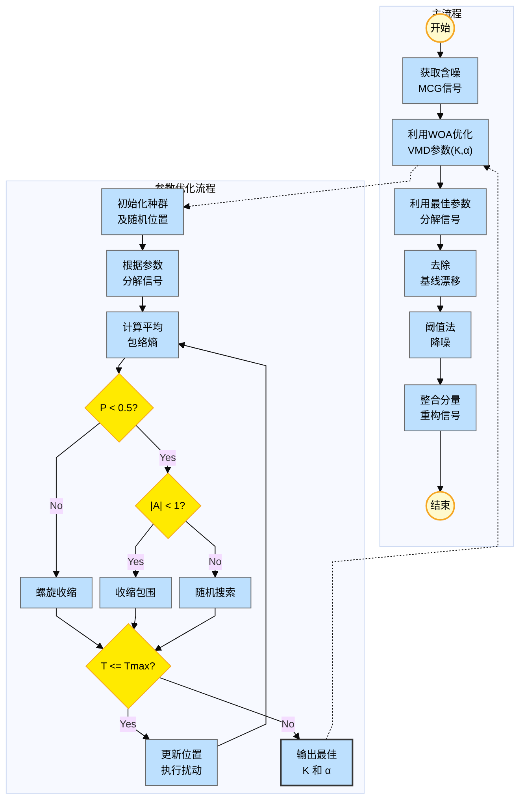

```mermaid
%%{init: {'theme': 'base', 'themeVariables': { 'fontSize': '13px'}, 'flowchart': {'nodeSpacing': 10, 'rankSpacing': 20, 'curve': 'linear', 'padding': 10} } }%%
graph TD
    %% 样式定义
    classDef process fill:#bde0fe,stroke:#666,stroke-width:1px,color:black;
    classDef decision fill:#ffea00,stroke:#f5a623,stroke-width:1px,color:black;
    classDef startend fill:#fffacd,stroke:#f5a623,stroke-width:2px,color:black;
    classDef output fill:#bde0fe,stroke:#333,stroke-width:2px,color:black;

    %% --- 右侧主流程 ---
    subgraph MainFlow [主流程]
        direction TB
        Start((开始)):::startend
        Acquire["获取含噪<br/>MCG信号"]:::process
        
        %% === 修复点：加上双引号 ===
        Optimize["利用WOA优化<br/>VMD参数(K,α)"]:::process
        
        UseParams["利用最佳参数<br/>分解信号"]:::process
        RemoveBaseline["去除<br/>基线漂移"]:::process
        Threshold["阈值法<br/>降噪"]:::process
        Integrate["整合分量<br/>重构信号"]:::process
        End((结束)):::startend

        Start --> Acquire
        Acquire --> Optimize
        Optimize --> UseParams
        UseParams --> RemoveBaseline
        RemoveBaseline --> Threshold
        Threshold --> Integrate
        Integrate --> End
    end

    %% --- 左侧 VMD 参数优化流程 ---
    subgraph Optimization [参数优化流程]
        direction TB
        Opt_Init["初始化种群<br/>及随机位置"]:::process
        Opt_Decomp["根据参数<br/>分解信号"]:::process
        Opt_Fitness["计算平均<br/>包络熵"]:::process
        
        %% 判定条件：必须加双引号
        Dec_P{"P < 0.5?"}:::decision
        Dec_A{"|A| < 1?"}:::decision
        
        Action_Spiral["螺旋收缩"]:::process
        Action_Shrink["收缩包围"]:::process
        Action_Random["随机搜索"]:::process
        
        %% 修复点：括号内容加引号
        Dec_T{"T <= Tmax?"}:::decision
        
        Action_Update["更新位置<br/>执行扰动"]:::process
        Opt_Output["输出最佳<br/>K 和 α"]:::output

        Opt_Init --> Opt_Decomp
        Opt_Decomp --> Opt_Fitness
        Opt_Fitness --> Dec_P
        
        Dec_P -- No --> Action_Spiral
        Dec_P -- Yes --> Dec_A
        
        Dec_A -- Yes --> Action_Shrink
        Dec_A -- No --> Action_Random
        
        Action_Spiral --> Dec_T
        Action_Shrink --> Dec_T
        Action_Random --> Dec_T
        
        Dec_T -- Yes --> Action_Update
        Action_Update --> Opt_Fitness
        
        Dec_T -- No --> Opt_Output
    end

    %% 连接关系
    Optimize -.-> Opt_Init
    Opt_Output -.-> Optimize
```
